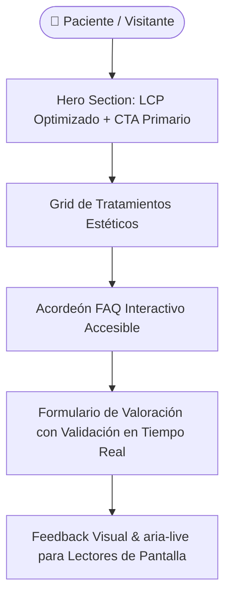

# Clínica Lumina — Landing Page de Medicina Estética

<div align="center">


**Solución web corporativa de alta conversión y máximo rendimiento para clínica de medicina estética de alta gama en Madrid, diseñada con estándares semánticos puros, cero dependencias pesadas y accesibilidad WCAG 2.1 AA.**

[🚀 Demo en Vivo](https://alxnrocha.github.io/landing-clinica-lumina/) • [📂 Repositorio en GitHub](https://github.com/alxnrocha/landing-clinica-lumina)

</div>

---

## 🏛️ Arquitectura y Flujo del Sistema



---

## ✨ Características Principales

- **Estructura Semántica & Accesibilidad:** Navegación optimizada con marcado semántico HTML5, atributos `aria-expanded`, `aria-controls` y navegación accesible por teclado (WCAG 2.1 AA).
- **Acordeón Interactivo de FAQ:** Módulo expandible nativo para resolver dudas frecuentes de pacientes sin librerías externas.
- **Formulario de Valoración con Validación:** Validación frontend en tiempo real de campos obligatorios con retroalimentación visual (`aria-invalid` y `aria-live`).
- **Rendimiento de Carga & Core Web Vitals:** Carga prioritaria del recurso LCP en el Hero y *lazy loading* nativo en imágenes secundarias.
- **Diseño Responsive:** Adaptación fluida para smartphones, tablets y pantallas de escritorio mediante CSS Flexbox y Grid variables.

---

## 🗂️ Estructura del Proyecto

```text
01-landing-clinica-lumina/
├── index.html                     # Documento HTML5 principal semántico
├── src/
│   ├── assets/                    # Iconos e imágenes optimizadas (WebP/SVG)
│   ├── css/
│   │   └── styles.css             # Arquitectura CSS con variables (:root)
│   └── js/
│       └── main.js                # Interacciones DOM y validación de formulario
├── LICENSE                        # Licencia MIT
└── README.md                      # Documentación del proyecto
```

---

## 🚀 Instalación y Puesta en Marcha

### Prerrequisitos
- Cualquier navegador web moderno (Chrome, Firefox, Edge, Safari).

### Ejecución Local
```bash
# 1. Clonar el repositorio
git clone https://github.com/alxnrocha/landing-clinica-lumina.git
cd landing-clinica-lumina

# 2. Abrir index.html directamente o servir localmente
npx serve .
```

---

## 🛠️ Tecnologías Utilizadas

| Capa | Tecnología | Aspectos Clave |
|---|---|---|
| **Estructura** | HTML5 Semántico | Landmark roles (`main`, `nav`, `section`), ARIA attributes |
| **Estilos** | CSS3 Moderno | Custom Properties (`:root`), Flexbox, CSS Grid, Fluid Typography |
| **Lógica** | JavaScript ES6+ | Manipulación nativa del DOM, event delegation, validación form |
| **Accesibilidad** | WCAG 2.1 AA | Contraste de color certificado, navegación por teclado y lectores de pantalla |
| **Despliegue** | GitHub Pages | Despliegue estático continuo y optimizado |

---

<div align="center">
  <sub>Desarrollado con dedicación por <a href="https://github.com/alxnrocha">Alex Rocha</a> • Proyecto 01 del Portafolio Profesional Frontend.</sub>
</div>
