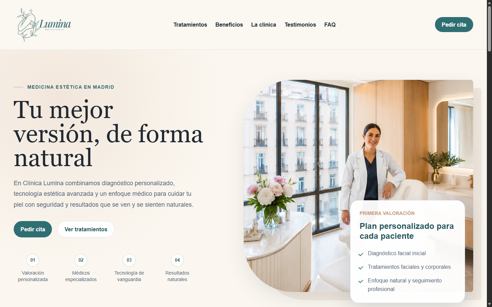
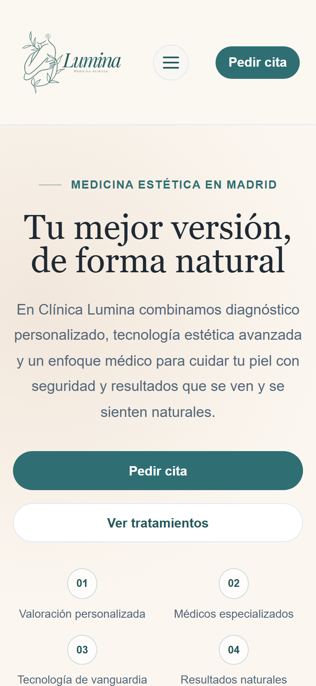

# Clínica Lumina — Landing Page de Medicina Estética

[](https://alxnrocha.github.io/landing-clinica-lumina/)
[](https://developer.mozilla.org/es/docs/Web/HTML)
[](https://developer.mozilla.org/es/docs/Web/CSS)
[](https://developer.mozilla.org/es/docs/Web/JavaScript)
[](./LICENSE)

**Clínica Lumina** es una landing page comercial responsiva diseñada para una clínica de medicina estética de alta gama en Madrid. El proyecto está enfocado en la conversión de clientes, accesibilidad web (WCAG) y optimización extrema de carga sin dependencias externas.

- 🌐 **Demo en Vivo (GitHub Pages):** [https://alxnrocha.github.io/landing-clinica-lumina/](https://alxnrocha.github.io/landing-clinica-lumina/)
- 📦 **Repositorio GitHub:** [https://github.com/alxnrocha/landing-clinica-lumina](https://github.com/alxnrocha/landing-clinica-lumina)

---

## 📸 Vistas Reales del Sistema

### 1. Vista Principal (Desktop)



### 2. Experiencia Responsive (Móvil)



---

## ✨ Características Principales

### 🚀 Experiencia de Usuario & Frontend
- **Estructura Semántica & Accesibilidad:** Navegación optimizada con etiquetas semánticas HTML5, atributos `aria-expanded`, `aria-controls` y navegación accesible por teclado.
- **Acordeón Interactivo de FAQ:** Módulo expandible accesible sin librerías pesadas para resolver dudas frecuentes de pacientes.
- **Formulario de Valoración con Validación:** Validación frontend en tiempo real de campos obligatorios con retroalimentación visual (`aria-invalid` y `aria-live`).
- **Rendimiento de Carga y Core Web Vitals:** Carga prioritaria del recurso LCP en el Hero y *lazy loading* nativo en imágenes secundarias para evitar saltos de layout (CLS).
- **Diseño Responsive:** Adaptación fluida para dispositivos móviles, tablets y pantallas de escritorio mediante CSS Flexbox y Grid.

---

## 🏛️ Estructura del Proyecto

```text
01-landing-clinica-lumina/
├── index.html                     # Documento HTML5 principal
├── screenshots/                   # Capturas de pantalla reales
│   ├── desktop.png
│   └── mobile.png
├── src/
│   ├── assets/                    # Iconos y recursos visuales optimizados
│   ├── css/
│   │   └── styles.css             # Arquitectura CSS y variables de diseño (:root)
│   └── js/
│       └── main.js                # Interacciones DOM y validación de formularios
├── BLUEPRINT.md                   # Registro de especificaciones
└── DECISIONS.md                   # Registro de decisiones de arquitectura (ADRs)
```

---

## ⚡ Guía de Inicio Rápido

### 1. Clonar el Repositorio
```bash
git clone https://github.com/alxnrocha/landing-clinica-lumina.git
cd landing-clinica-lumina
```

### 2. Ejecutar en Local
Al ser un proyecto desarrollado en Vanilla JavaScript, no requiere instalación de dependencias de Node.js:
- Abra `index.html` directamente en su navegador web, o
- Inicie un servidor local liviano con la extensión **Live Server** de VS Code o ejecutando `npx serve .`.

---

## 📄 Licencia

Este proyecto está bajo la Licencia MIT. Consulte el archivo [LICENSE](./LICENSE) para más detalles.

**Autor:** [Alexandre Rocha](https://github.com/alxnrocha)
